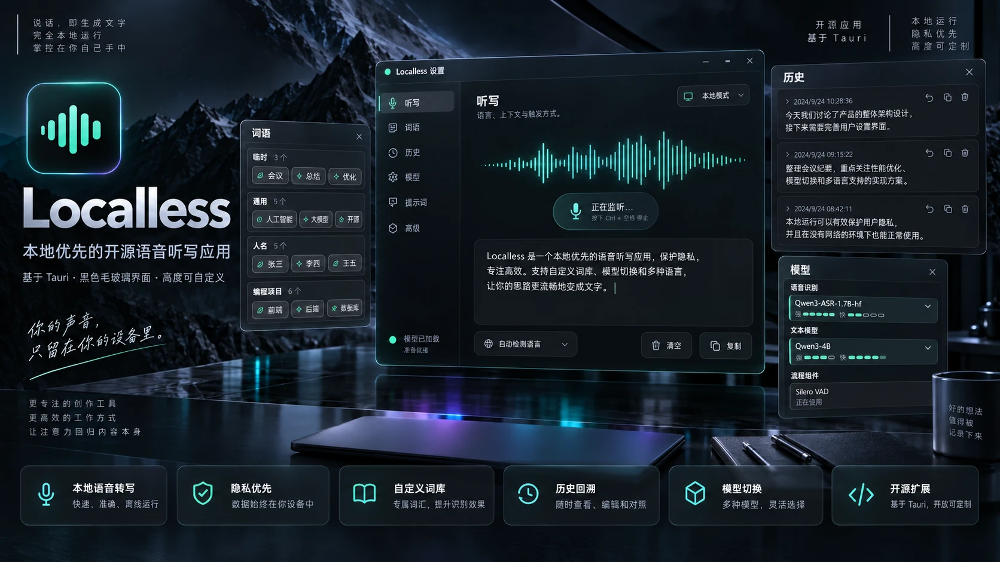

**中文** | [English](README.en.md)

# Localless：完全离线的语音听写



按住 **右 Alt** 说话，松开后文字自动送进光标所在的输入框。不联网、不登录、没有字数限制。

## 功能
- **本地识别**：Qwen3-ASR（1.7B / 0.6B）跑在自己的 GPU 上，音频不出本机
- **自定义词语**：按标签分组（通用 / 人名 / 编程项目…），识别时优先选这些写法
- **历史**：每条听写可回看、复制、对照原文
- **不打扰剪贴板**：听写完原来复制的东西原样还原；可选不进 Win+V 历史
- **悬浮麦克风**：远程桌面、触屏下也能用

## 环境
- Windows 10 / 11，NVIDIA 显卡（也有纯 CPU 模式，但慢）
- [Python 3.11](https://www.python.org/downloads/)
- 从源码编译还要 Rust

## 安装（Release 包）
1. 从 [Releases](https://github.com/fatassasin/Localless/releases) 下载 zip，解压到任意目录
2. 在解压出的目录里运行下面这条命令。它会建 Python 环境、装 PyTorch（CUDA 版），再下载语音模型，总共约 7 GB：
   ```bash
   powershell -ExecutionPolicy Bypass -File setup.ps1
   ```
   显存小可以加 `-Model qwen3-asr-0.6b-hf`，装完到设置 → 模型里选它；没有 NVIDIA 显卡就加 `-Cpu`
3. 双击 `localless.exe`

## 从源码编译
先跑一遍上面的 `setup.ps1`，再编译：
```bash
cd tauri/src-tauri && cargo build --release
```

## 打开方式
- **双击** `localless.exe`（源码编译的在 `tauri/src-tauri/target/release/`）
- **开机自启**：设置窗口 → 通用 → 开机启动

## 快捷键
| 操作 | 按键 |
|---|---|
| 听写（按住说话） | 右 Alt |

只有这一个，可以在设置窗口里改。除它之外不注册任何全局快捷键。

## 你的数据
设置、词语、听写历史、录音都只存在本机 `%APPDATA%\localless\`，**不在这个仓库里**，也不会上传到任何地方。
[`docs/localless-settings.example.json`](docs/localless-settings.example.json) 是一份通用设置模板，只用来看格式；第一次运行时程序会自己生成默认设置。

## 目录结构
- `tauri/src-tauri/`：Rust 壳，负责窗口、托盘、键盘钩子、剪贴板注入、历史库
- `tauri/src/`：界面，包括药丸、悬浮麦克风、设置页（打进二进制，改完要重新 `cargo build`）
- `app/engine.py`：本地识别服务，WebSocket 跑在 `127.0.0.1:8765`
- `app/*.ps1`：三个独立 sidecar，分别管键盘钩子、逐应用静音、读焦点控件
- `models/`：模型权重，不进 git

## 停止
托盘图标右键 → 退出。

## 测试
```bash
cd tauri/src-tauri && cargo test
```
```bash
node tauri/tests/pages.test.js && node tauri/tests/recorder.test.js && node tauri/tests/prompts.test.js
```
```bash
app/.venv/Scripts/python.exe -m unittest discover -s app -p "test_*.py"
```

## 许可
[CC BY-NC 4.0](https://creativecommons.org/licenses/by-nc/4.0/)：可以自由使用、修改、转发，但要署名，且不得用于商业用途。全文见 `LICENSE`。
模型权重不在本仓库里，各自遵循原作者的许可。
